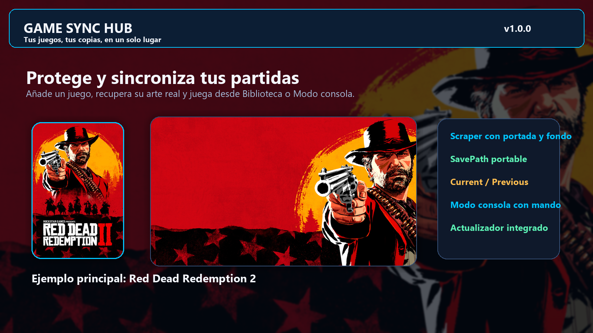
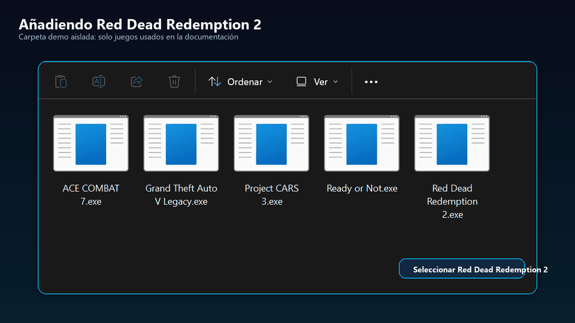
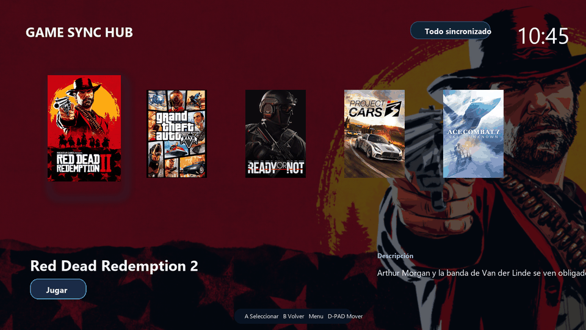

# Game Sync Hub

Official releases, updates and user support for **Game Sync Hub**.  
Versiones oficiales, actualizaciones y soporte para **Game Sync Hub**.

[English](#english) · [Español](#espanol)

**Latest stable release / Última versión estable:** [GitHub Releases](https://github.com/IMC93Labs/GameSyncHub-Releases/releases/latest)

---

## English

### What is Game Sync Hub?

Game Sync Hub is a portable Windows application designed to organize local PC games, protect and recover their save data, synchronize selected information through Google Drive, and provide a controller-friendly console experience for TV/couch use.

It combines the normal desktop library with local-first save protection, multi-PC recovery, automatic artwork/metadata enrichment, controller support and optional integrations such as Anti-UAC launch rules and an MSI Afterburner/RTSS performance-overlay shortcut.

### Highlights

- **Local-first save protection and recovery** with validated local protection, verified Current / Previous history and manual emergency recovery material.
- **Google Drive synchronization** for protected saves plus the information required to recover the Game Sync Hub library on another PC.
- **Offline-friendly operation**: if Internet or Drive is unavailable, a healthy local save remains usable and pending synchronization can resume when connectivity returns.
- **Self-healing cloud synchronization** for managed Drive resources, with safeguards against stale resource references, repeated retry loops and duplicate logical recovery staging.
- **Efficient manual recovery updates** that can reuse verified unchanged files instead of uploading the complete recovery tree again unnecessarily.
- **Multi-PC safety** with divergence detection based on save history rather than blindly choosing the newest timestamp.
- **New-PC/reinstall recovery**: recover the library from Drive and re-link a game to its new executable/save location.
- **Game metadata scraper**: search public candidates and apply available cover art, horizontal backgrounds, icons and descriptions.
- **Console Mode** with dynamic game artwork, themes, configurable background effects, favourites/recent games and controller-first navigation.
- **Controller support** for Xbox/XInput, PlayStation, Nintendo and generic HID devices, with adaptive button glyphs and reconnection handling.
- **Automatic Console Mode entry** when a controller is connected, if enabled, or direct Console Mode startup.
- **Play statistics** including play time, sessions and last-played information.
- **Transfer Center** for real synchronization activity, including pending, verifying, uploading and recovery work.
- **Optional Anti-UAC rules** for trusted games/launchers without globally disabling Windows UAC.
- **Optional MSI Afterburner + RTSS controller shortcut**: Menu/Start + View/Select can reuse the configured Toggle On-Screen Display hotkey during a game.
- **Built-in updater** for stable GitHub Releases, with SHA-256 verification, safe-state checks, startup handshake, rollback protection and automatic repair of the managed Windows-startup entry when enabled.
- **Portable single-file distribution**: the public Windows build is delivered as one self-contained `GameSyncHub.exe`.

➡️ **[See the complete feature guide](docs/guides/features.md)**

### Visual overview

Game Sync Hub can identify a real game, retrieve its available artwork/metadata, protect its save folder and present the result in both the desktop library and Console Mode.

- [Complete feature guide](docs/guides/features.md)
- [Visual documentation](docs/guides/visual-documentation.md)
- [Quick-start visual guide](docs/media/quick-start-en.png)
- [Recovery visual guide](docs/media/recovery-en.png)

### Downloads and updates

Official builds are published only in **[Releases](https://github.com/IMC93Labs/GameSyncHub-Releases/releases)**. The current stable build is always available from **[Latest release](https://github.com/IMC93Labs/GameSyncHub-Releases/releases/latest)**.

Game Sync Hub is distributed as a portable Windows executable. The built-in updater checks this repository for newer stable official releases and asks for confirmation before installing them. The downloaded executable is verified against the release manifest before replacement, and rollback protection is available if the new build cannot complete its startup confirmation. If **Start with Windows** is enabled, the new version validates and repairs its own startup registration so it continues to point to the current executable path and filename after an update.

> Do not download Game Sync Hub from unofficial mirrors unless a release note explicitly points to them.

### Save-safety design

Game Sync Hub is designed so that Google Drive adds redundancy rather than becoming a requirement for playing. When the local protection state is healthy, temporary loss of Internet or Drive should leave the game usable and keep synchronization pending for later.

Cloud conflicts, corruption or an unsafe local protection state are handled separately because those situations can require user attention before a save can be changed safely.

### Important notice

Game Sync Hub is a **personal hobby project**, created in my free time. I am **not a professional software developer**.

Development is carried out through **AI-assisted vibe coding**. Artificial-intelligence tools are used to generate, modify, review, document and test parts of the project.

The application is designed and tested with safety and reliability in mind, but software — especially software developed with AI assistance — can contain bugs, incompatibilities or unexpected behaviour. **Game Sync Hub is provided as-is, without guarantees, and you choose to use it at your own risk.**

Because Game Sync Hub can work with save files, local folders, NTFS links and cloud synchronization, keeping an **independent backup of important data** is strongly recommended.

Read the full **[Disclaimer](DISCLAIMER.md)** before using the application.

### Support

- **Bug:** [Report a bug](https://github.com/IMC93Labs/GameSyncHub-Releases/issues/new/choose)
- **Feature request:** [Request an improvement](https://github.com/IMC93Labs/GameSyncHub-Releases/issues/new/choose)
- **Questions and general help:** [Discussions](https://github.com/IMC93Labs/GameSyncHub-Releases/discussions)
- **Security issue:** read [Security policy](SECURITY.md) and report it privately when possible.

Support is provided on a best-effort basis. This is a hobby project and there is no guaranteed response time or service level.

### Source code

This repository is used for **official releases, public documentation and user support**. The source code is not published here.

See also: **[Support](SUPPORT.md)** · **[Security](SECURITY.md)** · **[Contributing](CONTRIBUTING.md)** · **[Disclaimer](DISCLAIMER.md)**

---

## Español

### ¿Qué es Game Sync Hub?

Game Sync Hub es una aplicación portable para Windows diseñada para organizar juegos locales de PC, proteger y recuperar sus partidas guardadas, sincronizar mediante Google Drive la información necesaria y ofrecer una experiencia de consola manejable con mando desde el televisor o el sofá.

Combina la biblioteca de escritorio con protección local-first de saves, recuperación multi-PC, enriquecimiento automático de arte/metadatos, soporte de mandos e integraciones opcionales como reglas Anti-UAC y el atajo de overlay de rendimiento de MSI Afterburner/RTSS.

### Funciones destacadas

- **Protección y recuperación local-first de partidas** con protección local validada, historial Current / Previous verificado y material de recuperación manual para emergencias.
- **Sincronización mediante Google Drive** de partidas protegidas y de la información necesaria para recuperar la biblioteca de Game Sync Hub en otro PC.
- **Funcionamiento sin conexión**: si Internet o Drive no están disponibles, una partida local sana puede seguir utilizándose y la sincronización queda pendiente hasta que vuelva la conexión.
- **Autorreparación de sincronización en Drive** para recursos gestionados, evitando referencias remotas obsoletas, bucles de reintento y staging lógico duplicado de recuperación.
- **Recuperación manual más eficiente**, reutilizando archivos idénticos ya verificados en lugar de volver a subir innecesariamente todo el árbol de recuperación.
- **Seguridad multi-PC** con detección de divergencias basada en el historial de partidas y no simplemente en la fecha más reciente.
- **Recuperación tras reinstalar/cambiar de PC**: recuperar la biblioteca desde Drive y volver a vincular cada juego con su nuevo ejecutable/ruta de saves.
- **Scraper de metadatos e imágenes**: busca candidatos públicos y aplica portada, fondo horizontal, icono y descripción cuando están disponibles.
- **Modo consola** con arte dinámico por juego, temas, efectos de fondo configurables, favoritos/recientes y navegación orientada a mando.
- **Soporte de mandos** Xbox/XInput, PlayStation, Nintendo y HID genéricos, con iconos adaptados y gestión de reconexión.
- **Entrada automática en Modo consola** al conectar un mando, si se activa, o inicio directo en Modo consola.
- **Estadísticas de juego** con tiempo jugado, sesiones y última vez jugado.
- **Centro de transferencias** para mostrar la actividad real de sincronización, incluyendo pendientes, verificación, subida y recuperación.
- **Reglas Anti-UAC opcionales** para juegos/launchers de confianza sin desactivar globalmente el UAC de Windows.
- **Atajo opcional para MSI Afterburner + RTSS**: Menu/Start + View/Select puede reutilizar la tecla Toggle On-Screen Display configurada para abrir/cerrar el overlay durante un juego.
- **Actualizador integrado** para Releases estables de GitHub, con validación SHA-256, comprobación de estado seguro, confirmación de arranque, rollback y reparación automática del inicio con Windows gestionado cuando está activado.
- **Distribución portable en un solo archivo**: la versión pública de Windows se entrega como un `GameSyncHub.exe` self-contained.

➡️ **[Ver la guía completa de funciones](docs/guides/features.md#español)**

### Vista visual

Game Sync Hub puede identificar un juego real, obtener su arte/metadatos disponibles, proteger su carpeta de partidas y mostrar el resultado tanto en la biblioteca de escritorio como en Modo consola.

- [Guía completa de funciones](docs/guides/features.md#español)
- [Documentación visual](docs/guides/visual-documentation.md)
- [Guía visual rápida](docs/media/quick-start-es.png)
- [Guía visual de recuperación](docs/media/recovery-es.png)

### Descargas y actualizaciones

Las compilaciones oficiales se publican únicamente en **[Releases](https://github.com/IMC93Labs/GameSyncHub-Releases/releases)**. La compilación estable actual siempre está disponible en **[Latest release](https://github.com/IMC93Labs/GameSyncHub-Releases/releases/latest)**.

Game Sync Hub se distribuye como un ejecutable portable para Windows. El actualizador integrado consulta este repositorio para detectar versiones oficiales estables más recientes y solicita confirmación antes de instalarlas. El ejecutable descargado se valida frente al manifiesto de la Release antes de sustituir el actual y existe protección de rollback si la nueva versión no completa correctamente su confirmación de arranque. Si **Iniciar con Windows** está activado, la nueva versión valida y repara su propia entrada de inicio para que siga apuntando a la ruta y nombre actuales del ejecutable después de una actualización.

> No descargues Game Sync Hub desde mirrors o páginas no oficiales salvo que una Release indique expresamente lo contrario.

### Diseño de seguridad de las partidas

Game Sync Hub está diseñado para que Google Drive añada redundancia en lugar de convertirse en un requisito para jugar. Cuando la protección local está sana, una caída temporal de Internet o Drive debe permitir seguir utilizando el juego y dejar la sincronización pendiente para más tarde.

Los conflictos de nube, corrupción o un estado local de protección inseguro se tratan de forma separada porque esas situaciones sí pueden necesitar intervención antes de modificar una partida con seguridad.

### Aviso importante

Game Sync Hub es un **proyecto personal creado como hobby** y desarrollado en mi tiempo libre. **No soy desarrollador de software profesional.**

El desarrollo se realiza mediante **vibe coding asistido por inteligencia artificial**. Se utilizan herramientas de IA para generar, modificar, revisar, documentar y probar partes del proyecto.

La aplicación se diseña y prueba buscando que sea segura y fiable, pero cualquier software —especialmente software desarrollado con ayuda de IA— puede contener errores, incompatibilidades o comportamientos no previstos. **Game Sync Hub se proporciona tal cual, sin garantías, y cada usuario decide utilizarlo bajo su propia responsabilidad.**

Como Game Sync Hub puede trabajar con partidas guardadas, carpetas locales, enlaces NTFS y sincronización en la nube, se recomienda encarecidamente mantener una **copia de seguridad independiente de los datos importantes**.

Lee el **[Aviso y responsabilidad](DISCLAIMER.md)** completo antes de utilizar la aplicación.

### Soporte

- **Error:** [Reportar un problema](https://github.com/IMC93Labs/GameSyncHub-Releases/issues/new/choose)
- **Mejora:** [Solicitar una mejora](https://github.com/IMC93Labs/GameSyncHub-Releases/issues/new/choose)
- **Preguntas y ayuda general:** [Discussions](https://github.com/IMC93Labs/GameSyncHub-Releases/discussions)
- **Problema de seguridad:** consulta la [Política de seguridad](SECURITY.md) y repórtalo de forma privada cuando sea posible.

El soporte se presta en la medida de lo posible. Es un proyecto realizado como hobby y no existe un tiempo de respuesta ni un nivel de servicio garantizados.

### Código fuente

Este repositorio se utiliza para **versiones oficiales, documentación pública y soporte a usuarios**. El código fuente no se publica aquí.

Consulta también: **[Soporte](SUPPORT.md)** · **[Seguridad](SECURITY.md)** · **[Contribuir](CONTRIBUTING.md)** · **[Aviso y responsabilidad](DISCLAIMER.md)**

---

**Game Sync Hub — IMC93Labs**
