# Game Sync Hub — Visual documentation / Documentación visual

[English](#english) · [Español](#español)

---

## English

This guide uses a continuous demo based on real game metadata and media cached by Game Sync Hub. The main flow follows **Red Dead Redemption 2** from add-game to library and Console Mode.

### 1. Add a game

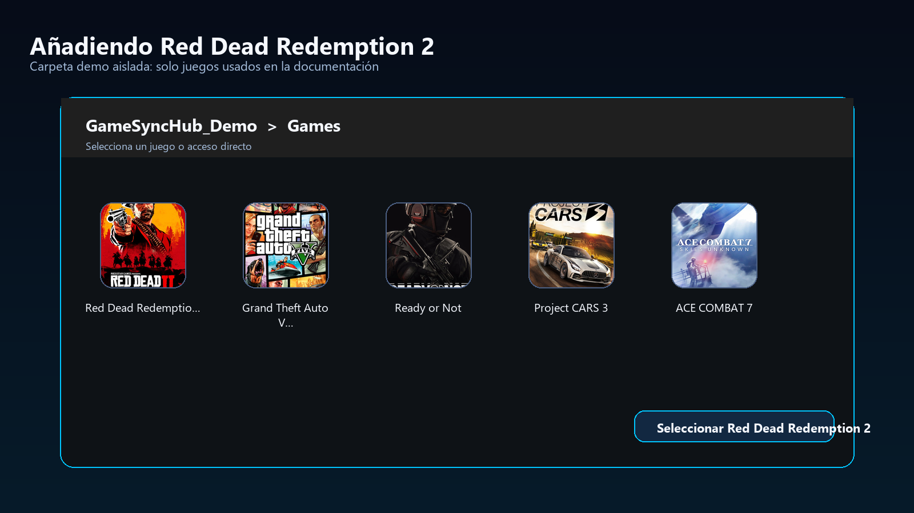

Game Sync Hub accepts EXE, LNK, BAT and CMD launchers. The launcher path is local to the PC and is not synchronized to Google Drive.

### 2. Scraper and game art

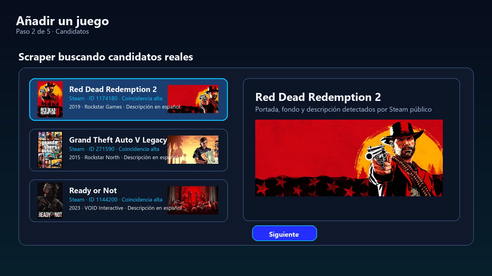

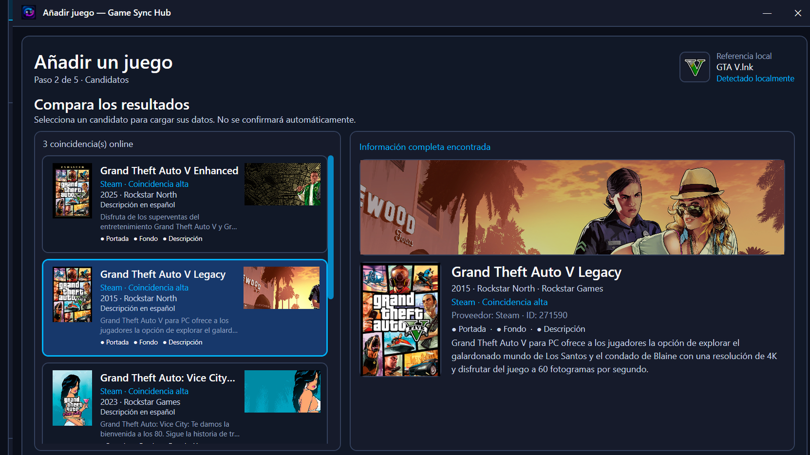

The assistant keeps a stable provider identity, such as Steam AppID, and associates cover, background and description with that game.

### 3. SavePath and protection

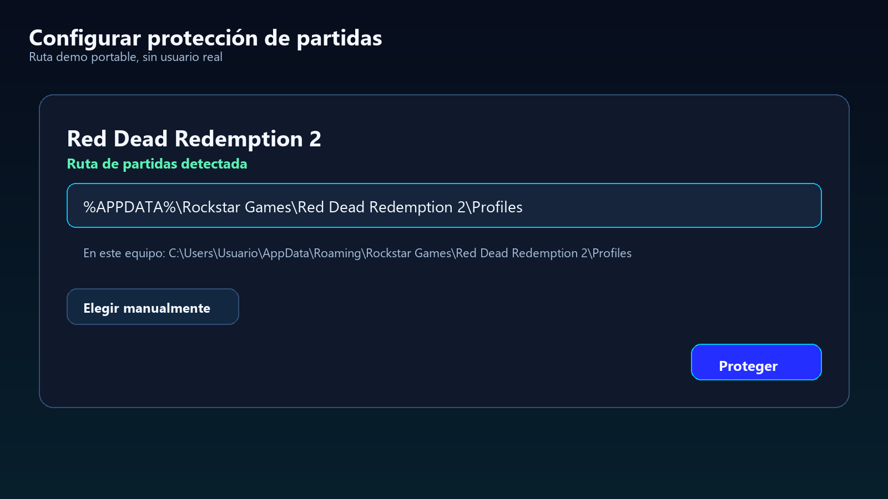

Known save paths are portable. Game Sync Hub suggests paths only when they exist on the current PC.

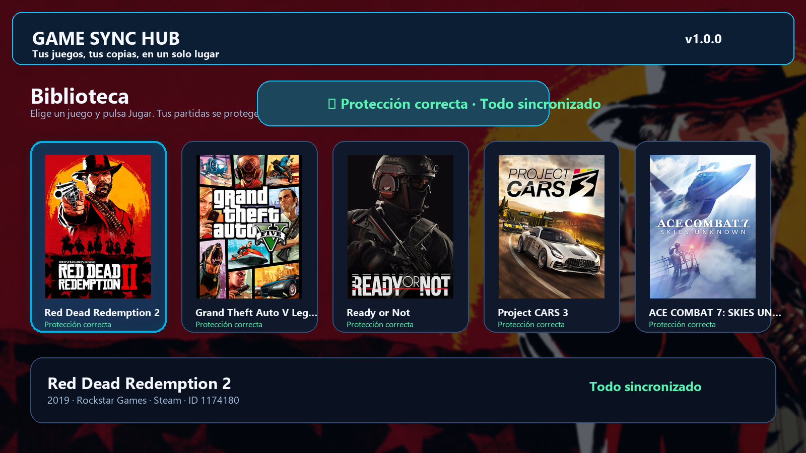

### 4. Library

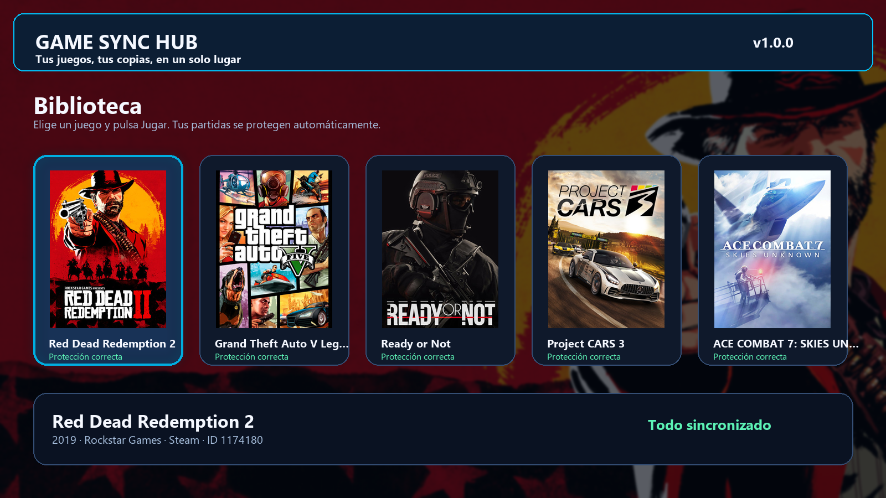

The demo library shows Red Dead Redemption 2 plus other real games with their own cover/background metadata.

### 5. Console Mode

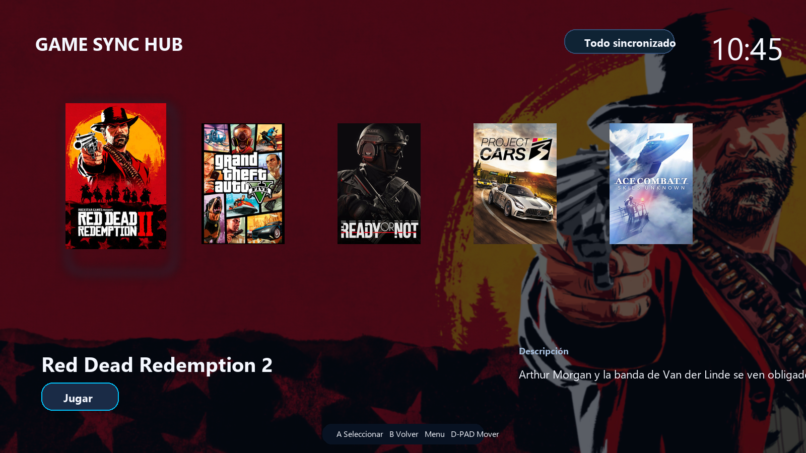

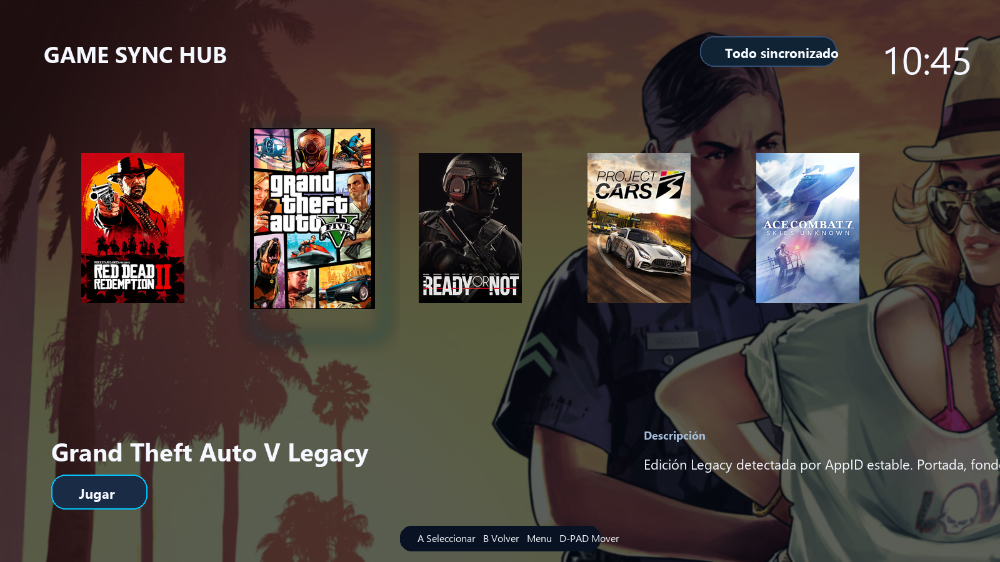

The selected game changes the cover and background dynamically.

### 6. Controller integration

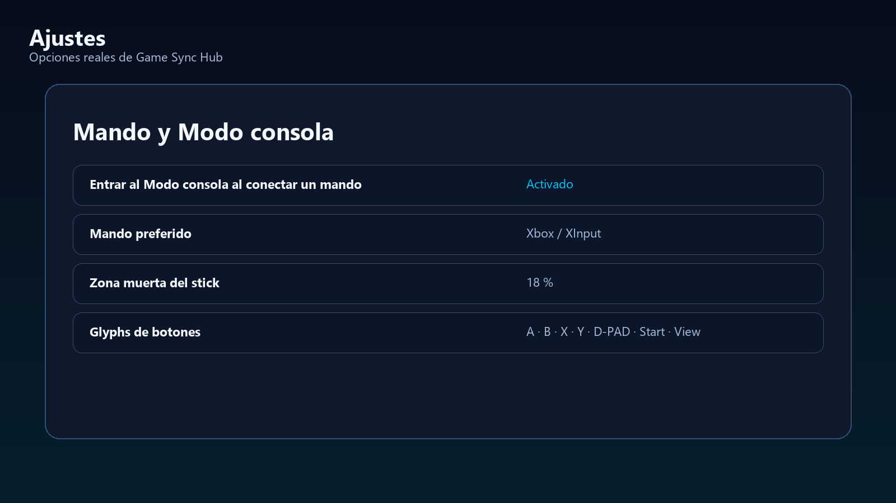

Console Mode is designed around logical actions, with controller glyphs adapted to the selected controller profile.

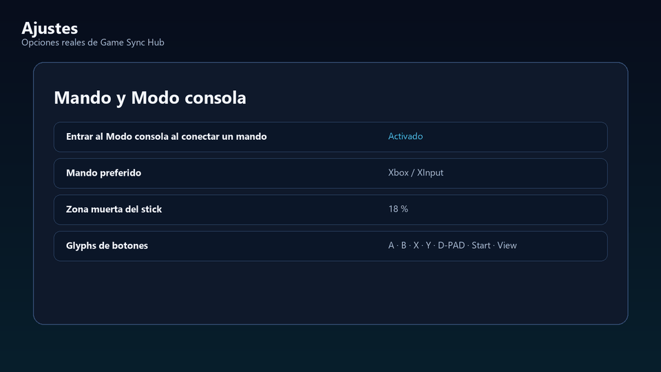

### 7. Performance overlay shortcut

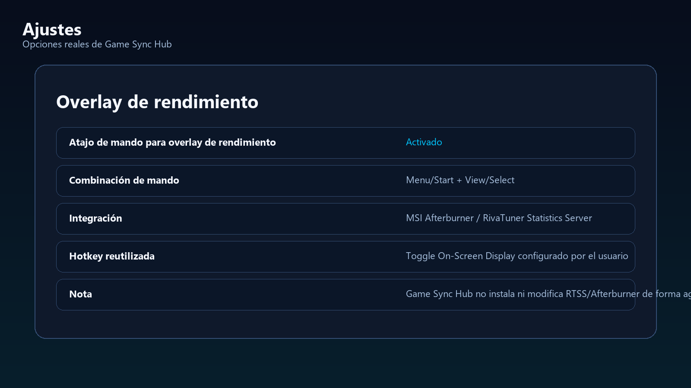

Game Sync Hub does not install MSI Afterburner or RivaTuner Statistics Server. With MSI Afterburner + RTSS already configured, Menu/Start + View/Select toggles the RTSS On-Screen Display directly when the RTSS interface is available, independently of the keyboard hotkey configured in Afterburner. The hotkey path remains only as a compatibility fallback.

### 8. Anti-UAC launcher support

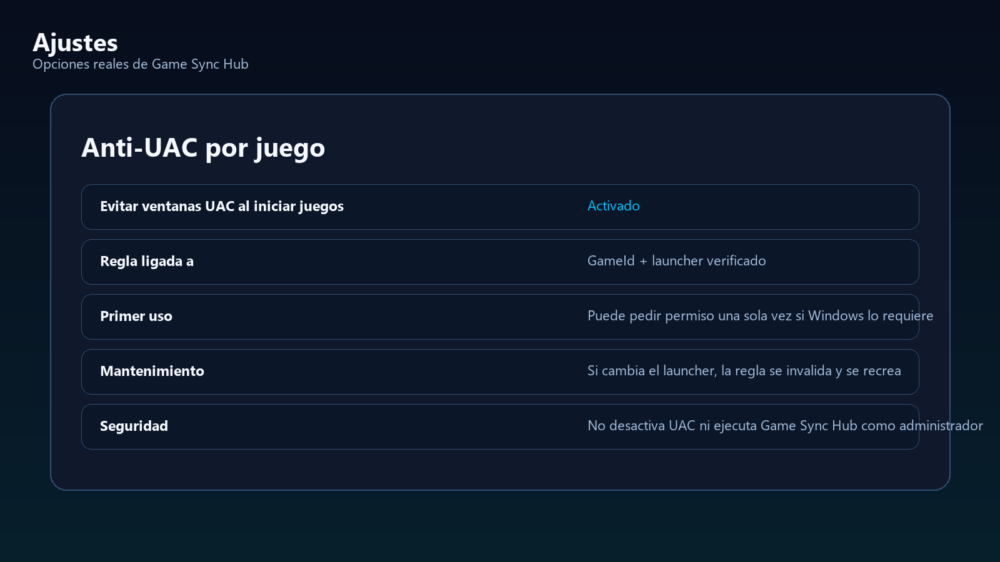

Anti-UAC rules are tied to the game identity and verified launcher. Game Sync Hub does not disable Windows UAC globally.

### 9. Recovery

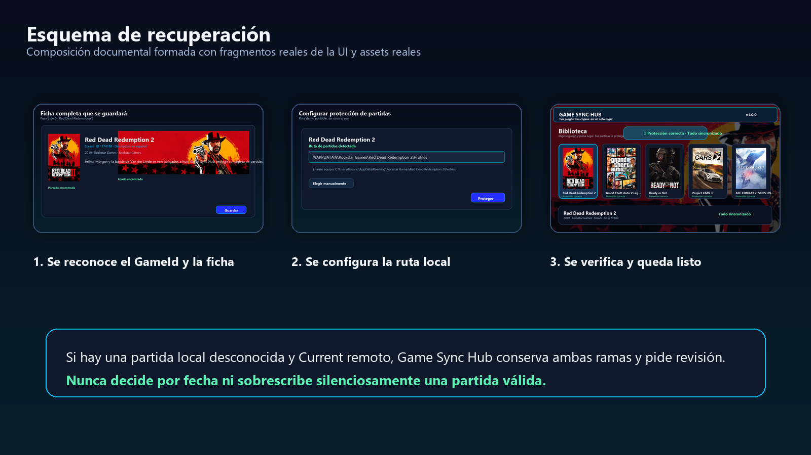

The recovery image is marked as a guide: it is built from real UI fragments and real cached media to explain the safety flow without exposing personal data.

### 10. Updates

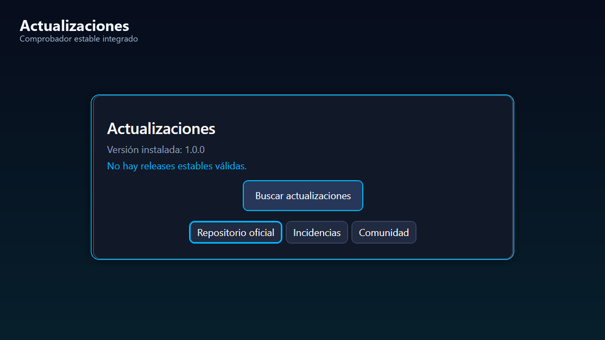

Stable public updates are checked from the official release repository.

---

## Español

Esta guía usa una demo continua basada en metadatos y multimedia reales cacheados por Game Sync Hub. El flujo principal sigue **Red Dead Redemption 2** desde el alta hasta la biblioteca y el Modo consola.

### 1. Añadir un juego

Game Sync Hub acepta lanzadores EXE, LNK, BAT y CMD. La ruta del lanzador es local del PC y no se sincroniza con Google Drive.

### 2. Scraper y arte del juego

El asistente conserva una identidad estable del proveedor, como Steam AppID, y asocia portada, fondo y descripción con ese juego.

### 3. SavePath y protección

Las rutas conocidas de partidas son portables. Game Sync Hub solo las sugiere cuando existen en el PC actual.

### 4. Biblioteca

La biblioteca demo muestra Red Dead Redemption 2 y otros juegos reales con su propia portada/fondo.

### 5. Modo consola

El juego seleccionado cambia dinámicamente la portada y el fondo.

### 6. Mandos

El Modo consola usa acciones lógicas y adapta los glyphs al perfil de mando seleccionado.

### 7. Atajo de overlay de rendimiento

Game Sync Hub no instala MSI Afterburner ni RivaTuner Statistics Server. Con MSI Afterburner + RTSS ya configurados, Menu/Start + View/Select muestra u oculta directamente el OSD de RTSS cuando su interfaz está disponible, independientemente de la tecla configurada en Afterburner. La ruta basada en hotkey queda únicamente como fallback de compatibilidad.

### 8. Anti-UAC

Las reglas Anti-UAC se vinculan a la identidad del juego y a un launcher verificado. Game Sync Hub no desactiva UAC globalmente.

### 9. Recuperación

La imagen de recuperación está marcada como guía: usa fragmentos reales de UI y multimedia real cacheada para explicar el flujo sin exponer datos personales.

### 10. Actualizaciones

Las actualizaciones públicas estables se comprueban desde el repositorio oficial de releases.
